# Sparkify

Sparkify is a fictional music streaming service, comparable to Spotify. In this project, a user log of approx. 12 GB is given. The entries contain all events created by single users, e.g. by logging in, selecting the next song, or liking a song. 

Some users within this event log cancelled their subscription. The goal of this project is to predict for a given trace of user evens whether this user is likely to cancel his subscription and consequently stop to use Sparkify.

The technical solution is based on PySpark and Jupyter Notebook. It is executable on Amazon EMR.

## Project results

The results can be found in the write-up [here](https://github.com/philippmarcus/dsnd-sparkify/blob/master/writeup.md) and also below in this Readme.

## Usage instructions

1. Start a local `jupyter-pyspark` container by executing `./start_pyspark.sh`
2. Open the URL shown in the command line in your web browser
3. Execute the Jupyter Notebook 

The data is not contained in this repo and needs to be downloaded from the following locations:

- Full Sparkify Dataset (12Gb): <s3n://udacity-dsnd/sparkify/sparkify_event_data.json>
- Mini Sparkify Dataset (123Mb): <s3n://udacity-dsnd/sparkify/mini_sparkify_event_data.json>


## Files

The project contains the following files:

```
.
├── README.md
├── Sparkify.ipynb (Main Notebook)
├── img (Images used in the writeup)
├── model (Trained machine learning models)
├── requirements.txt (Required python packages)
├── src (Source code that is included in the notebook)
├── start-pyspark.sh (Script to start a Spark/Jupyter docker container)
├── writeup.md (Writeup Markdown)
└── writeup.pdf (Writeup PDF)
```

## Requirements

See `requirements.txt`, basically the project requires pyspark, pandas, numpy, Jupyter notebook, seaborn, matplotlib.

## Acknowledgements

Thanks to Udacity for providing the data set and project idea.

# Sparkify - Technical Project Description

## Project Definition 

### Project Overview

Sparkify is a fictional music streaming service, comparable to Spotify. Users can create an account, use the service and also have the chance to cancel their subscription, i.e. churn. If a user churned, he definitely will not contribute to future revenue of Sparkify or help to promote the service. To reduce the numbers of churned users, it is necessary to detect such users that might churn in the future and offer promotions or discounts in order to keep them as loyal users.

 |  
:-------------------------:|:-------------------------:

This project is the cap-stone project of the Udacity Data Science Nano-degree. Udacity provides a Sparkify user event log that spans 60 full days and contains all events created by each single user, e.g. by logging in, selecting the next song, or liking a song. Two versions of the data set are available, a full version of 12 GB and a tiny subset of 128 MB. 

In this Project, the data is loaded, cleaned, explored, features are extracted and machine learning models are built and evaluated. It is basically capable to be deployed on an AWS EMR cluster.

### Problem Statement

In order to detect users that might churn in the future, the goal is to build a feature vector for each user that is part of the event log, train a machine learning model based on it and finally use this model to predict whether a given user might churn or not. Due to the size of the given dataset, this process needs to be conducted in Apache Spark.

The data sets are provided by Udacity in the following locations:

- Full Sparkify Dataset (12Gb): <s3n://udacity-dsnd/sparkify/sparkify_event_data.json>
- Mini Sparkify Dataset (123Mb): <s3n://udacity-dsnd/sparkify/mini_sparkify_event_data.json>


### Metrics

Before the machine learning model can be selected and trained, the right performance measure for the Sparkify problem needs to be defined:

- Precision: `TP / (TP + FP)` - describes the percentage, when a reported cancelling user really was a cancelling user.
- Recall: `TP / (TP + FN)` - describes the percentage of cancelling users that were correctly detected.
- F1: Harmonic mean between Precision and Recall. Favors such models that have a balanced ratio of Precision and Recall.

In this project, the output of the classificator will be used to offer discounts to users in order to avoid their cancellation. The right tradeoff between precision and recall decides between loosing revenue by granting unnecessary discounts or loosing revenue by not properly care for users that might cancel soon.

In case the classifier is tuned to a high recall and low precision, Sparkify would make sure that most of the potentially cancelling users get a discount and probably keep them as users. However, the Sparkify company would waste money due to the low precision, as loyal users are classified as cancelling users more often.

If the classifier is tuned to a low recall and high precision, the Sparkify streaming service could probably miss the timely discount for cancelling users, leading to higher cancellation rates. On the other side, the expenses for unnecessary discounts are reduced, as the detections of cancelling users are more precise.

> A tradeoff between unnecessary discounts to loyal users and not missing any potentially cancelling user needs to be found.

The final decision largely depends on the pricing model of the company. What discount is needed to convince a customer to stay loyal? What is the monthly revenue generated by a loyal users? These numbers need to be considered when defining the correct threshold. As these details are not clear, in the following, the models are trained to get a balanced recall and precision ratio, thus the `F1` score is used.


## Analysis

### Data Exploration

Within the provided data set, each row corresponds to a user event and comes along with the following 18 columns:

```
root
 |-- artist: string (nullable = true)
 |-- auth: string (nullable = true)
 |-- firstName: string (nullable = true)
 |-- gender: string (nullable = true)
 |-- itemInSession: long (nullable = true)
 |-- lastName: string (nullable = true)
 |-- length: double (nullable = true)
 |-- level: string (nullable = true)
 |-- location: string (nullable = true)
 |-- method: string (nullable = true)
 |-- page: string (nullable = true)
 |-- registration: long (nullable = true)
 |-- sessionId: long (nullable = true)
 |-- song: string (nullable = true)
 |-- status: long (nullable = true)
 |-- ts: long (nullable = true)
 |-- userAgent: string (nullable = true)
 |-- userId: string (nullable = true)
```
To get a better understanding, let's look at one potential entry:

```
Row(artist='Pool Vuh', 
auth='Logged In', 
firstName='Shlok', 
gender='M', 
itemInSession=278, 
lastName='Johnson',
length=524.32934, 
level='paid', 
location='Dallas-Fort Worth-Arlington, TX', method='PUT', 
page='NextSong', 
registration=1533734541000, 
sessionId=22683, 
song='Ich mache einen Spiegel - Dream Part 4', 
status=200, 
ts=1538352001000, 
userAgent='"Mozilla/5.0 (Windows NT 6.1; WOW64) AppleWebKit/537.36 (KHTML, like Gecko) Chrome/36.0.1985.143 Safari/537.36"', 
userId='1749042')
```
Generally, the information can be grouped into several blocks:

- User-related information:`firstName`, `gender`, `location`, `userId`, `registration`. That information is rather self explanatory and is the same in all events triggered by that user.
- Session-related information: `auth`, `sessionId`, `userAgent`, `level`. This stays the same during a session of a given users.
- Action-related information: `itemInSession`, `length`, `page`, `song`, `status`, `ts` This information changes from event to event, for example the `page` describes the specific event type, and `ts` is the timestamp in milliseconds.

The information contained in column `page` tells us the specific action a user performed and could be one of the following 20 categories:

```
+--------------------+
|                page|
+--------------------+
|           Downgrade|
|       Save Settings|
|               Error|
|     Add to Playlist|
|                Help|
|      Submit Upgrade|
|              Cancel|
|    Submit Downgrade|
|         Thumbs Down|
|                Home|
|         Roll Advert|
|               About|
|             Upgrade|
|Cancellation Conf...|
| Submit Registration|
|               Login|
|            Register|
|            NextSong|
|           Thumbs Up|
|              Logout|
+--------------------+
```

The data set contains missing values for `artist`, `firstName`, `gender`, `lastName`, `length`, `location`, `registration`, `sessionId` and `userAgent`. This is mainly caused by the fact that also such events are contained in the log that are done by anonymous users, reflected with an empty userId. Also, some `page` events simply do not involve and `artist`. The fact that data is missing needs to be considered before submission to the machine learning algorithm, either by filling up the missing values (imputation), or deleting the affected rows.

For further processing, a column `churn` needs to be added to each entry that contains `1` if the row belongs to a user that churned and `0` otherwise. This is achieved by first adding a column `phase`, that contains a `1` for all `Cancellation Confirmation` events and finally summing up this column partitioned by the `userId` for each user.

This reveals that the full data set contains `5003` users that cancelled their subscription and overall `17275` users did not cancel their subscription.

### Data Visualization

In the following, data visualizations are built to convey the information associated exploration conducted on the provided data.

#### Gender distribution

In the following it is evaluated whether the gender of a user shows correlation to the churn.

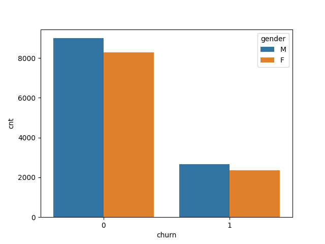

This graph was evaluated on the full data set and shows that the ratio of men and women in both groups approximately follows the same ratio.

#### Average length

The length event is filled out for NextSong and indicates the length of the played song. The listening behaviours could carry information about whether a user might churn or not.

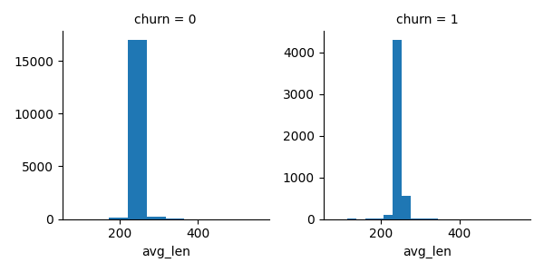

This graph was evaluated on the full data set and shows that both distributions follow a different shape, where the distribution for churned users shows a larger standard deviation. Thus this feature will be included into the feature extraction process.

#### Items per session

The items per session can carry information about how intensively a user interacts with the portal and also about the session length. This could also contribute to explain the churn.

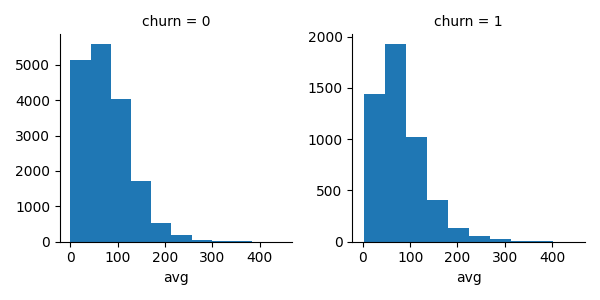

Again evaluated on the full data set. The graph shows a slightly different distribution for both groups.

#### Average sessions per day

The average sessions per day is counted by dividing the overall session count of a given user by the number of days from the first event observed until the last event observed.

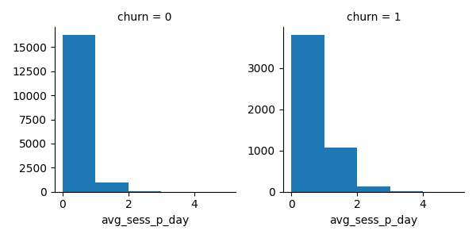

The distribution for churned users tends to have a fatter tail. It can be assumed that this feature also contributes to the classification process. This evaluation was also done on the full data set.

#### Daytime of service usage

The daytime when the service is used might tell something about the potential of a user to churn. For example, users that frequently use the service in the evening might have a different churn rate than users that rather tend to use the service in the office or during lunch.

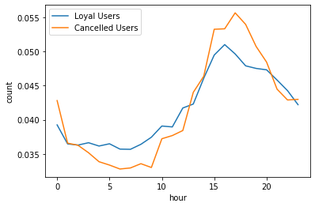

The data shows that loyal users are more active during the morning hours and cancelled users tend to have a relatively higher activity during the afternoon. This evaluation was done on the small dataset for performance reasons.

#### Weekday of service usage

The weekday might also play a role to distinguish users that churn from loyal users. For example, users that tend to use the service during workdays might have a different probability to churn than users that use the service during the weekend.


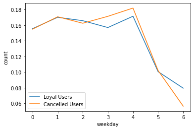

The percentage of usage follows a very similar line, however, cancelled users tend to listen more on Thursday and Friday, while loyal users tend to listen more on Sunday. This evaluation was done on the small dataset for performance reasons.

#### User system distribution
The type of user agent could play a role with regards to the churn rage, for example if the experience on a smartphone device is worse than on other devices.

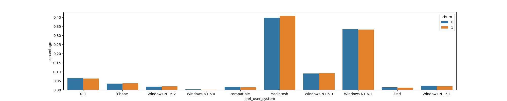

Loyal users tend to use the iPad, iPad, MacOS, Windows NT 6.1 and compatible more often than users that cancelled. Probably the user experience is better than the desktop app, or people prefer to listen to music en route. This evaluation was done on the full dataset.

#### Age of the account

The length of the trace in days helps to understand when the decision for cancellation is made. The idea is to compare the first and last timestamp of each user and calculate the days in-between:

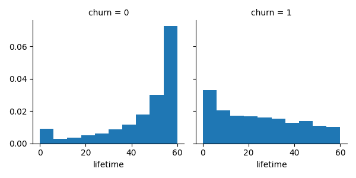

The following average account ages in days were observed:

| churn | avg       | 
|-------|-----------|
| 0     | 45.293372 | 
| 1     | 23.886468 | 

The cancellation of accounts happens rather right away, as the distribution shows. However, when an account reaches a certain age of e.g. 60 days, it might carry information whether the user will cancel the subscription.

#### Average session duration
It can be assumed that the length of a session depends on the degree of satisfaction with the music service. This is evaluated by analyzing the distribution of session lengths in minutes:

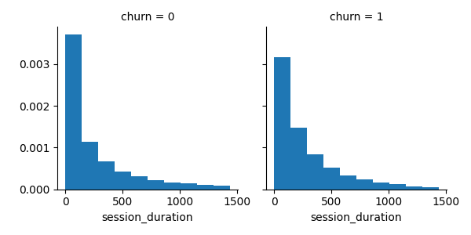

The distribution of session duration for churned users has a stronger positive skew. In addition, the average, minimum and maximum session durations for each user group are plotted:

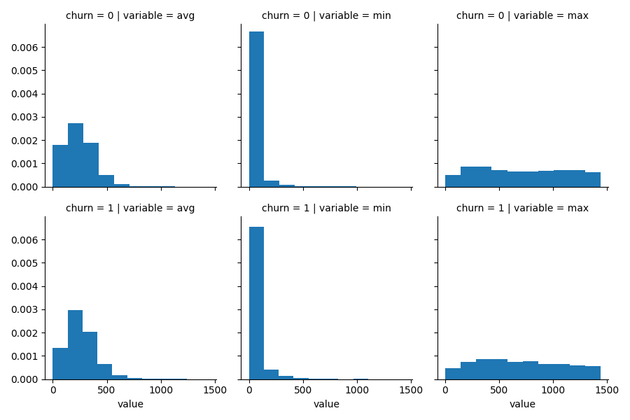

The upper row shows the average, minimum and maximum session duration for loyal users. The lower row shows these values for churned users. These aggregated value do not show any obvious difference in the aggregated metrics for session duration. This evaluation was done on the full dataset.

#### Payment level

Users change the payment plan over time. The up- or downgrade could give an indication about a likelihood of cancellation. For example, the downgrade to a free usage could be a first indication that the user might delete his account.


The left column compares the number of upgrades for both user groups. The up- and downgrade distribution looks similar for both groups. This evaluation was done on the full dataset.

#### Average Click-count of pages per session

It can be assumed that loyal users tend to have a different click pattern than users that cancelled. For that, for each page, the average click count over all sessions of a given user group is calculated.

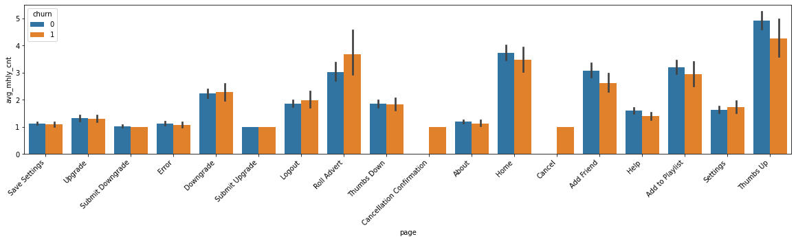

The average monthly click count for NextSong is not shown in this overview, as it is several times larger. This evaluation was done on the full dataset.

## Methodology

### Data Preprocessing

Before the features are extracted, several data cleaning steps are applied in order to remove unnecessary columns, extract sub-strings from larger texts, and remove rows that contain invalid values.

#### Data Cleaning

##### Clean the userAgent column

The column `userAgent` contains a complete HTTP User-Agent request header. One example is:

`'Mozilla/5.0 (Windows NT 6.1; WOW64; rv:31.0) Gecko/20100101 Firefox/31.0'`

For the feature extraction, all information except the operating system is skipped, as device type / OS type could be relevant. Also the browser information could be considered in a future extension of the project. The cleaning steps is basically performed by applying a regular expression on the `userAgent` column to extract the group matching the operating system.

##### Remove empty user names

As the target is to detect for known users whether they might cancel or not, all events generated by anonymous sessions are dropped. Technically, those rows are dropped where the `userId` matches the empty string `''`.

##### Delete unnecessary columns

The columns related to the name of the user, name of the listened song and the HTTP method (get/put) are deleted. The assumption is that this information does not affect the decision of a user to cancel its subscription.

### Feature Extraction

The feature extraction is conducted in a pipeline in a separate script. Basically, the pipeline works with SQL commands and creates a table `features_df` with the following information:

- Average sessions per day
- Average song length
- Average items per session
- Account age
- Average session duration
- Preferred user system as dummy variables
- The average click rate per session for each of the possible pages, except 'Cancellation Confirmation'

##### Average sessions per day
The feature for `Average sessions per day` is calculated based on the following command:

```sql
SELECT userId, COUNT(DISTINCT sessionId) / (to_days(MAX(ts) - MIN(ts))+1) as avg_sess_p_day
FROM df_table
GROUP BY userId
```
We group by userId, count the number of distinct sessionIds for that user and divide it by the account age in days. Here, `to_days(...)` is a user defined function, based on the python `datetime` module.

##### Average song length
The feature for the average song length is calculated as follows:

```sql
SELECT userId, avg(length) as avg_length
FROM df_table
GROUP BY userId
```
We group by `userId`, and calculate the average of the column `length` for each group.

##### Average items per session
For each user, the average items per session are calculated:

```sql
SELECT userId, AVG(itemInSession) as avg_items_p_sess
FROM df_table
GROUP BY userId
```
Again, we group by `userId` and calculate the average of the column `itemInSession`, assuming that its values start to count ascending from 0 for each new session.

##### Account age in days
Add a column for the account age in days:

```sql
SELECT userId, to_days(MAX(ts) - MIN(ts)) as acc_age
FROM df_table
GROUP BY userId
```
We group be the column `userId`, calculate the difference between the latest and oldest timestamp observed for that user and convert the timedelta to days.

##### Average session length in minutes
This calculation is based on a two-step approach. First, we create a helper table that holds all session lengths for each user in minutes:

```sql
SELECT userId, to_minutes(MAX(ts)-MIN(ts)) as len
FROM df_table
GROUP BY userId, sessionId
```
Here, we group be `userId` and `sessionId`. This allows for each session to calculate the difference between the first and last timestamp and convert it to minutes. The function `to_days(...)` is a user defined function, based on the python `datetime` module. The results are stored in a temporary view called `tmp_sess_lens`. Based on that, we compute the average over the session lengths of each user:

```sql
SELECT userId, AVG(len) as avg_sess_len
FROM tmp_sess_lens
GROUP BY userId
```

##### A dummy variable for the gender

The gender of the user is given as `F` or `M` in the column `gender`. However, to apply this value to a machine learning algorithm, it needs to be binarized:

```sql
SELECT userId, 
		CASE WHEN gender = 'F' THEN 1 ELSE 0 END as gender
FROM df_table
```
The results are stored in a temp view `usr_gender`, however it still contains one row for each original event of the data set. To boil it down to only one row per user, the following step is applied:

```sql
SELECT userId, MAX(gender) as bin_gender
FROM usr_gender
GROUP BY userId
```
Basically, it groups by `userId` and takes the maximum of the `gender` column of our temp view - as the gender does not change, also the minimum could be taken and would yield the same result.

##### Preferred user system

For each user, the mode of its used system is calculated as follows:

```sql
SELECT userId, MAX(userSystem) as pref_user_system
FROM df_table
GROUP BY userId
```
Invalid values are filled up with `unknown`. Next, the values need to be converted to indices, as plain strings cannot be processed by most machine learning algorithms. A `StringIndexer` is applied:

```python
# Index the preferred user system (macos, iPhone etc...)
stringIndexer = StringIndexer(inputCol="pref_user_system", 
                              outputCol="pref_user_system_ind",
                              stringOrderType="frequencyDesc")
```

Afterwards, one-hot encoding is applied, i.e. for each observed system, a column is created and marked `0` or `1` for each user depending whether that system matches the mode of the `userSystem` for a given user or not:

```python
# Apply one-hot-encoding for the user system
ohe = OneHotEncoder(inputCol="pref_user_system_ind",
                    outputCol="pref_user_system_ohe", 
                    dropLast=True)
```
These created dummy columns are actually contained in a vector that is stored in column `pref_user_system_ohe`.

##### Average clicks per session for each Page

This feature will show the number of average clicks per session for each of the possible values in `page`. That means, how often does the user for example click `NextSong` in average per session? This value is computed in several steps. First, we aggregate the count for each page in each session:

```sql
SELECT userId, sessionId, page, COUNT(page) as cnt, to_month(AVG(ts)) as month
FROM df_table
GROUP BY userId, sessionId, page
```
The result is stored in a temp view `pages_per_session`. Here, `to_month(...)` is a user defined function, based on the python `datetime` module. Next, we compute the average page counts per user per sessions per month:

```sql
SELECT userId, page, month, AVG(cnt) as avg_cnt
FROM pages_per_session
GROUP BY userId, month, page
```
Again, the result is stored in a temp view called `tmp`. Next, we calculate the average page counts per user over all months:

```sql
SELECT userId, page, AVG(avg_cnt) as avg_mhly_cnt
FROM tmp
GROUP BY userId, page
```
The result is stored in a temp view `tmp2`. Based on this temp view, we create a pivot, fill empty values with 0 and drop the column 'Cancellation Confirmation', as this is our label:

```python
pages_pivot_df =tmp2.groupBy("userId") \
					.pivot("page") \
					.sum("avg_mhly_cnt") \
					.fillna(0) \
					.drop("Cancellation Confirmation")
```
Finally, all column names are renamed to skip spaces.

#### Combine the preprocessed temp views

Each of the SQL snippets shown above creates is own temp view with the column `userId` and columns for its respective features. Those temp views are merged to one uniform `features_df` data frame by iteratively joining over the `userId` column. The final table `features_df` has the following schema:

```
root
 |-- userId: string (nullable = true)
 |-- churn: long (nullable = true)
 |-- avg_sess_p_day: double (nullable = true)
 |-- avg_length: double (nullable = true)
 |-- avg_items_p_sess: double (nullable = true)
 |-- acc_age: integer (nullable = true)
 |-- avg_sess_len: double (nullable = true)
 |-- bin_gender: integer (nullable = true)
 |-- pref_user_system: string (nullable = false)
 |-- pref_user_system_ind: double (nullable = false)
 |-- pref_user_system_ohe: vector (nullable = true)
 |-- About: double (nullable = false)
 |-- Add_Friend: double (nullable = false)
 |-- Add_to_Playlist: double (nullable = false)
 |-- Cancel: double (nullable = false)
 |-- Downgrade: double (nullable = false)
 |-- Error: double (nullable = false)
 |-- Help: double (nullable = false)
 |-- Home: double (nullable = false)
 |-- Logout: double (nullable = false)
 |-- NextSong: double (nullable = false)
 |-- Roll_Advert: double (nullable = false)
 |-- Save_Settings: double (nullable = false)
 |-- Settings: double (nullable = false)
 |-- Submit_Downgrade: double (nullable = false)
 |-- Submit_Upgrade: double (nullable = false)
 |-- Thumbs_Down: double (nullable = false)
 |-- Thumbs_Up: double (nullable = false)
 |-- Upgrade: double (nullable = false)
```

#### Handling Imbalance of the classes

The `churn` is highly imbalanced over the provided samples in both data sets, as the number of loyal users is more than 3 times higher than the number of cancelling users. The following figure illustrates this for the tiny data set:

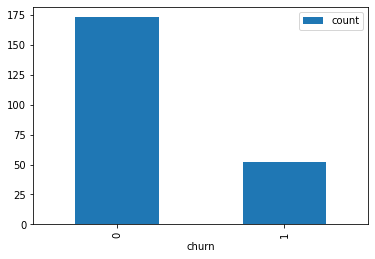

We have 173 loyal users and 52 churned users. In order to avoid a bias in the classifier, according measures need to be applied. Following choices are considered:

- Define a column weightCol, available after Spark 3.0.0
- Up- or Down-sample the classes

As at the time of writing no Docker image for Spark 3.0.0 was available, the approach of down-sampling is applied. In order to balance the classes, the positive (`churn` = 1) examples are all used, and the set of negative examples is down-sampled according to the ratio of negative to positive samples:

```python
# Ratio of positive examples
pos_ratio = (float(churn_pos_cnt) / (churn_neg_cnt))

# Perform the sub-sampling of negative examples
sampled = churn_neg_samples.sample(False, pos_ratio)
```
This reduced the number of loyal users to 55 on the tiny dataset.

#### Creating a test/train and validation data set

First, the data set is split into two parts, a `train_test` set, that is used for 3-fold cross-validation, and a `validation` set:

```python
# Split data for training/test and validation
train_test, validation = features_df_bal.randomSplit([0.9, 0.1], seed=42)
```

### Implementation of the ML Pipeline

To modularize the creation of machine learning pipelines for different algorithms, like Decision Trees, SVM etc., a helper function is created to build a Spark ML pipeline based on a given classifier for the given feature names in the given DataFrame. Its return value is a `CrossValidator` that needs to be fitted with `.fit(df)` to the training/validation set:

```python
def ml_pipeline_factory(inputCols, classifier, param_gird=None):
    # VectorAssembler
    vecAssembler = VectorAssembler(inputCols=inputCols,
                                   outputCol="features")


    # Normalizer / Scaler
    maScaler = MaxAbsScaler(inputCol="features",
                            outputCol="features_scaled")


    # Define a pipeline
    pipe = Pipeline(stages=[vecAssembler,
                            maScaler,
                            classifier])

    # Use cross-validation
    cv = CrossValidator(estimator=pipe,
                        evaluator=MulticlassClassificationEvaluator(labelCol='churn',
                                                                    metricName='f1'),
                        estimatorParamMaps=param_gird,
                        numFolds=3,
                        parallelism=4)

    return cv
```
This pipeline first applies a `VectorAssembler` on the feature columns passed with the argument `inputCols`. A `MaxAbsScaler` is applied to normalize the vectors. Finally, a `Pipeline` is defined. The classifier used in this pipeline is passed as an argument to the function and needs to be a classifier instance of `pyspark.ml.classification`.

For parameter optimization, a `CrossValidator` is defined that performs a grid search based on the passed `param_grid` and optimizes the `F1` score as discussed in the beginning.

Based on this, easily a full pipeline can be created:

```python
# Build a Naive Bayes Pipeline
def build_naivebayes_pipeline(inputCols):
    # Create the model
    nb = NaiveBayes(featuresCol='features_scaled',
                    labelCol='churn', 
                    predictionCol='prediction')

    # Param grid for model optimization
    grid = ParamGridBuilder().addGrid(nb.modelType, ["multinomial"]).build()

    # Build the pipeline
    pipe = ml_pipeline_factory(inputCols, nb, grid)
    return pipe
```
This builds a Naive Bayes-based Spark ML pipeline for the given
feature names in the given DataFrame. Result is a `CrossValidator` that
needs to be fitted with `.fit(df)` to the training/validation set.

## Results

First, the data set is split into two parts, a `train_test` set, that is used for 3-fold cross-validation, and a `validation` set. The following models are evaluated:

- Linear Support Vector Machine
- Naive Bayes
- Logistic Regression
- Random Forest

The single models are tuned based on a parameter grid-search and optimized against their `f1` score. The models are evaluated according to the `f1` score and their `accuracy`. The winning model is finally applied to the `validation` set.

### Model Evaluation and Validation

The trained machine learning models were evaluated against the validation set. Due to the small size of the tiny data set, this validation set typically only consists of 10 - 20 samples and should be extended to the full 12Gb data set in the next step.

In a first approach, the features related to the average click rate per session for each of the possible pages were not used during the training. This led to a precision and recall of approx. 80% - 87% for the four classifiers used. In the next step, these features were used as well. This led to the following results:

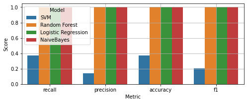

As the results show, overfitting occurred with the model when all the engineered features are used. All models except the SVM algorithm show a precision, recall and F1 of 1.0. Contrary, SVM only achieved a recall of 0.375, a precision of 0.14 and a f1 score of 0.2.

This is either caused by the high number of features used or by the low overall size of the used data set. Except for the SVM, all models achieved 100% precision and accuracy on the training and on the validation dataset. One approach to fight the overfitting is to use the full 12Gb dataset and conduct the training on a bigger Spark cluster, for example using AWS EMR. Alternatively, it could also be tried out to drop features with a low importance. The importance of features can be analyzed for example based on a decision tree, or the general feature importance score of other classifiers. In this case, the overfitting did not occur on the SVM. One possible reason is that the boundary between the two classes in the high dimensional feature space is not clear and the data is rather noisy. Thus it would also be worth to further experiment with the `c`-parameter of the SVM algorithm.

## Conclusion

In this project, a end-to-end machine learning pipeline based on Apache Spark was created in order to detect users that might cancel their subscription with a fictional music streaming service called Sparkify. This analysis was done based on a event log that spans 60 days - as the analysis was conducted on a local machine, only the tiny subset was used. After cleaning the data and extracting features, several machine learning algorithms were evaluated. Here it turned out, that overfitting occurred due to the small size of the data set and the many features used and further evaluation on the full data set is required.

A particular challenge with the data set was the highly imbalanced classes of loyal and churned users, which could lead to a biased classifier. This problem was tackled by down-sampling the loyal users, however which leads to the loss of data. Alternatively, up-sampling of the churned users could be applied by duplicating or slightly modifying existing entries.

Also it was challenging to detect features that contribute to a correct classification result on the one side and can be efficiently computed on the other side. 

In the next steps, several improvements need to be applied to the project, first of all to down-select the most important features and to train machine learning models on the full 12Gb data set. For this, the relevant parts should be extracted in a proper pipeline, for example based on Luigi or Apache Airflow and submitted as a Spark job instead of a Jupyter notebook. Also, it would be important to drop all but the most important features to further tackle the overfitting problem.
